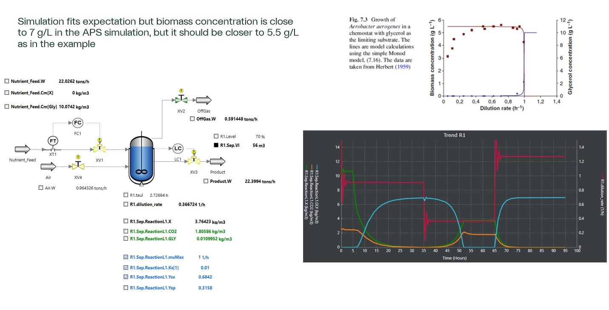

# Chemostat in APS

Monod Kinetic model of chemostat with glycerol as substrate modeled in AVEVA Process Simulator.  
The example is based on Example 7.1 (pg 282) in Bioreaction Engineering Principles.  

**⚠️ WARNING: Use at Your Own Risk**  
>
> This code is provided as-is and without any guarantees and is for educational purposes.  

  

# TODO
* Add OTR and OUR
* Use proper thermo fluid
* Add maintenance
